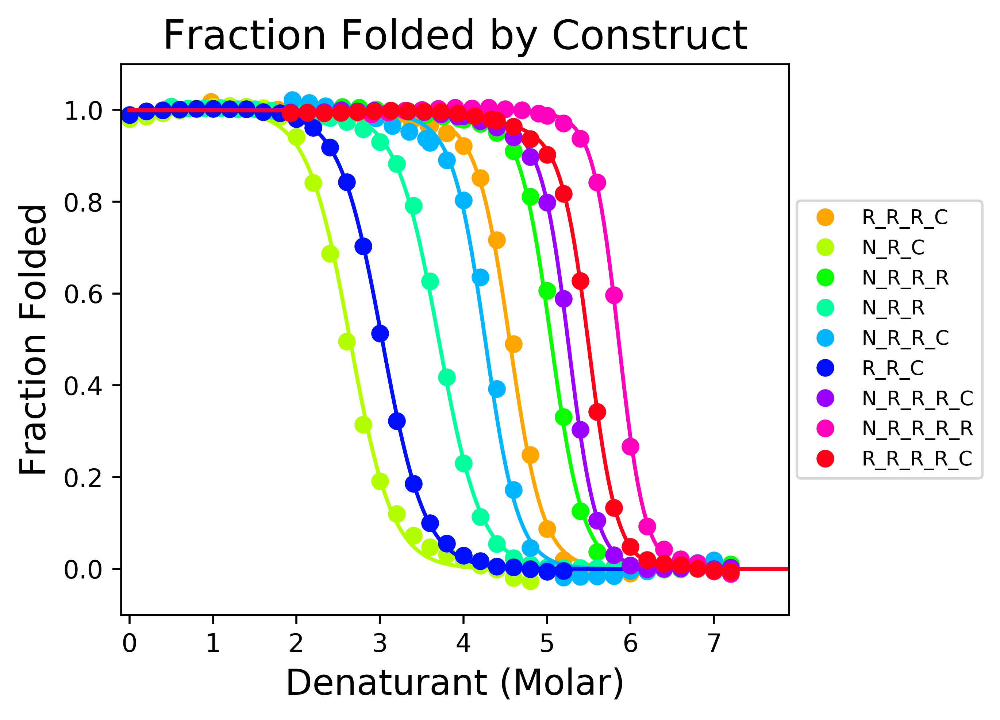
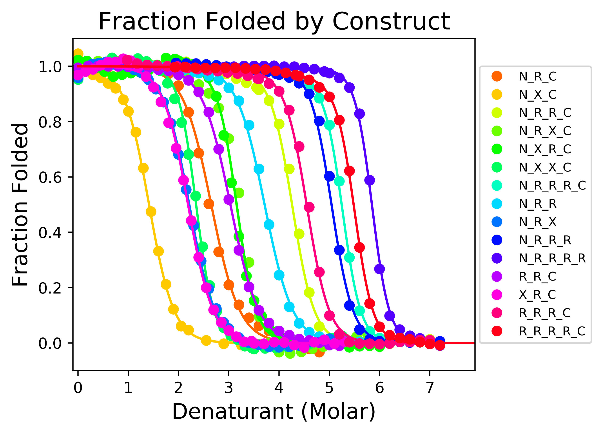

# Ising_programs

A suite of python programs to analyze repeat-protein unfolding data with a 1D Ising model. 

Homopolymer 1D Ising Fit           |  Heteropolymer 1D Ising Fit
:-------------------------:|:-------------------------:
  |  


This repository contains four main folders. The two main folders (```heteropolymer_fit``` and ```homopolymer_fit```) contain scripts to run 1D Ising analysis.
One is for "capped homopolymeric" NRC-type repeats, and the other is for capped heteropolymeric NRXC-type repeats.
Both perform nonlinear least-squares fits generated plots, and perform and statistical analysis using boostrap resampling.

In addition there is a folder (```data_conversion```) with some additional scripts to convert and merge data files of different types.

Finally, there is a folder for calculation of partial correlation coefficients from bootstrapped thermodynamic parameters (```partial_correlation```).

All folders contain data files which contain protein folding data on which the scripts can be run.  All programs were written in python 3.8.

A detailed description of this suite of programs and its applications will soon be submitted to the journal Protein Science
for publication.  A preprint can be obtained from Doug Barrick (barrick@jhu.edu).

## Publications which use these programs
1) Marold JD, Kavran, JM, Bowman GD, Barrick D. A naturally occurring repeat protein with high internal sequence identity defines a new class of TPR-like proteins. *Structure*. 2015 Nov 3; 23(11): 2055–2065. https://www.ncbi.nlm.nih.gov/pmc/articles/PMC4811334/.

2) Geiger-Schuller K, Barrick D. Broken TALEs: Transcription activator-like effectors populate partly folded states. Biophys J. 2016;111:2395–2403

3) Geiger-Schuller K, Sforza K, Yuhas M, Parmeggiani F, Baker D, Barrick D. Extreme stability in de novo-designed repeat arrays is determined by unusually stable short-range interactions. *Proc Natl Acad Sci U S A* 2018 Jul 17; 115(29): 7539–7544. https://www.ncbi.nlm.nih.gov/pmc/articles/PMC6055163/.

4) Geiger-Schuller K, Mitra J, Ha T, Barrick D. Functional instability allows access to DNA in longer transcription Activator-Like effector (TALE) arrays. *Elfie*. 2019 Feb 27;8:e38298.https://pubmed.ncbi.nlm.nih.gov/30810525/

If you would like your work cited here, please contact barrick@jhu.edu.

## License
[License](LICENSE.txt)

## Setup
To run the most recent code, follow the instructions below:
1. git clone the repository:

    ```git clone https://github.com/barricklab-at-jhu/Ising_programs.git```
  
2. Create and activate a new environment (requires conda or miniconda):
    ```bash
    conda env create -f ./Ising_programs/environment.yml
    conda activate ising_py3
    ```
   
To run a version of the code linked to the publication, <insert protein science link> follow these instructions:
1. git clone the publication branch from the repository:

    ```git clone -b publication_master https://github.com/barricklab-at-jhu/Ising_programs.git```
  
2. Create and activate a new environment (requires conda or miniconda):
    ```bash
    conda env create -f ./Ising_programs/environment.yml
    conda activate ising_py3
    ```

If one is more comfortable working in ```virtualenv```, a ```requirements.txt``` is also provided.

## Quikstart
1. To run the code via the self-contained instructional notebooks (after setup above):
   * ```jupyter notebook```
   * navigate to```homopolymer_fit/ising_fitter_homopolymer_fit.ipynb``` OR ```heteropolymer_fit/ising_fitter_heteropolymer_fit.ipynb```

2. To run each program independently (after setup above):
   * Each program can be executed independently in the directory it resides:
      * e.g. ```python data_conversion.py```
      
      

      